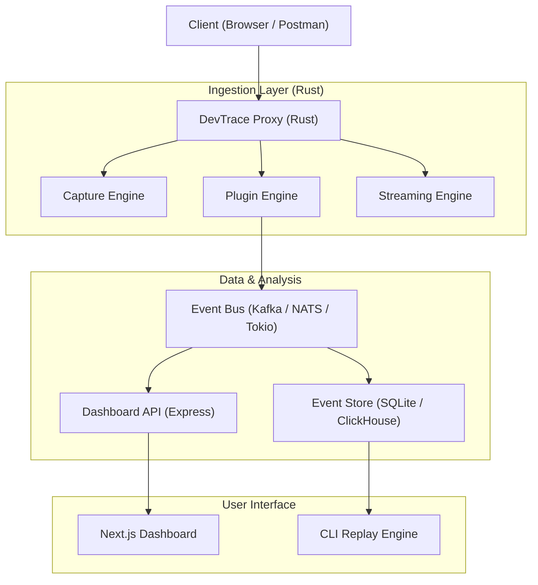

# 🧠 DevTrace — Distributed Developer Observability Engine


**DevTrace** is a high-performance, developer-centric observability platform designed to capture, analyze, replay, and introspect API traffic in real time. 

Unlike traditional logging tools, DevTrace operates as a **queryable observability engine core**, enabling developers to debug systems with production-grade fidelity.

---

## ⚡ Key Features

- **🚀 Real-Time Interception**: Capture request-response cycles with zero-copy instrumentation.
- **🔍 Query Engine**: Filter and sort logs using URL-based query parameters with a type-safe filtering system.
- **🔁 Replay Engine**: Resend captured requests directly from the CLI to simulate and debug edge cases.
- **🔌 Plugin Architecture**: Extend the processing pipeline with custom Rust-based analyzers.
- **📊 Live Dashboard**: A modern Next.js interface for real-time traffic visualization and latency heatmaps.
- **🧬 Time-Travel Debugging**: Powered by Immutable Logs (Event Sourcing) for deterministic troubleshooting.

---

## 🏗️ Architecture

DevTrace follows a **CQRS (Command Query Responsibility Segregation)** pattern, splitting the high-throughput write path (capture) from the analytical read path (visualization).



---

## 🧰 Technology Stack

| Component | Responsibility | Technology |
| :--- | :--- | :--- |
| **Logger (Agent)** | Low-latency traffic interception & proxying | Rust, Tokio, Hyper |
| **Backend (API)** | Query layer, event processing, and management | Node.js, Express, TypeScript |
| **Frontend** | Real-time traffic visualization dashboard | Next.js, TailwindCSS, WebSockets |
| **Storage** | Highly indexed event storage | JSON/SQLite (Local), ClickHouse (Prod) |

---

## 🚀 Getting Started

### 1. Prerequisite Setup
Ensure you have the following installed:
- [Rust](https://rustup.rs/) (edition 2021)
- [Node.js](https://nodejs.org/) (v18+)
- [npm](https://www.npmjs.com/) or [yarn](https://yarnpkg.com/)

### 2. Component Installation

#### 🦀 Logger (Rust Proxy)
```bash
cd logger
cargo build --release
```

#### ⚡ Backend (Express API)
```bash
cd backend
npm install
cp .env.example .env # Update environment variables if necessary
npm run dev
```

#### 📊 Frontend (Next.js Dashboard)
```bash
cd frontend
npm install
npm run dev
```

---

## 🛠️ Sub-System Deep Dives

### 🔌 Plugin Engine
Extend DevTrace by implementing the `Plugin` trait in Rust:
```rust
trait Plugin {
    fn process(&self, event: &TraceEvent);
}

// Example: Latency Analyzer, Error Detector, Auth Validator
```

### 🔁 Replay Engine
Replay past requests directly from the CLI to fix bugs deterministically:
```bash
devtrace replay --route /api/login --id <event-id>
```

---

## 🎯 Project Roadmap

- [x] **Phase 1**: Core Request/Response interception & proxy logic.
- [x] **Phase 2**: Structured logging, latency tracking, and modular logging architecture.
- [x] **Phase 3**: Queryable Log Engine
  - Query parsing system (`/logs?key=value`)
  - Strongly typed filtering (`LogFilter`)
  - Store-level filtering & sorting
  - Type-safe sorting (`SortBy` enum)
  - Clean separation of handler, filter, and store layers
- [ ] **Phase 4**: Advanced Query Engine
  - JSON serialization with `serde`
  - Pagination (`limit`, `offset`)
  - Zero-copy filtering (iterator-based references)
  - Validation & error handling system
- [ ] **Phase 5**: Distributed ingestion (Kafka/NATS) + persistent Event Store
- [ ] **Phase 6**: Replay Engine CLI + Webhook integrations
- [ ] **Phase 7**: Real-time Analytics Dashboard (Next.js + WebSockets)

---

## 📄 License
This project is for internal developer observability. All rights reserved.

Created by **@pd241008**

