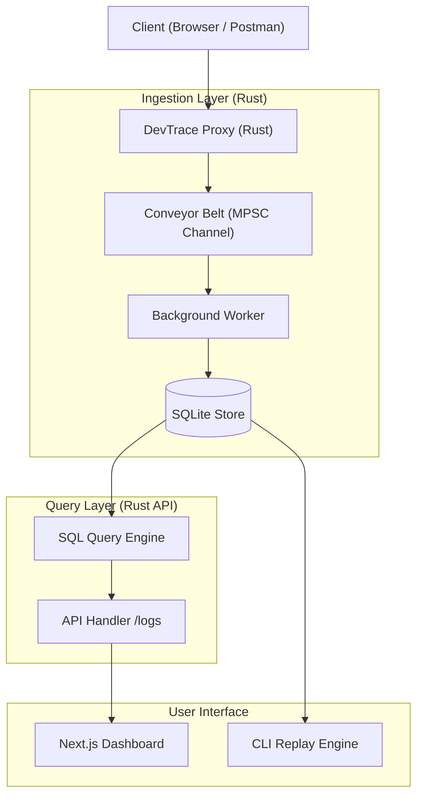

# 🧠 DevTrace — Distributed Developer Observability Engine


**DevTrace** is a high-performance, developer-centric observability platform designed to capture, analyze, replay, and introspect API traffic in real time. 

Unlike traditional logging tools, DevTrace operates as a **queryable observability engine core**, enabling developers to debug systems with production-grade fidelity.

---

## ⚡ Key Features

- **🚀 Real-Time Interception**: Capture request-response cycles with zero-copy instrumentation.
- **🏗️ Conveyor Belt Ingestion**: High-throughput non-blocking ingestion via Tokio MPSC channels (10k log buffer).
- **🗄️ Persistent Event Store**: All logs are safely stored in an optimized SQLite database.
- **🔍 SQL-Backed Query Engine**: Filter and sort logs using URL parameters directly at the database level.
- **📊 Live Dashboard**: A modern Next.js interface for real-time traffic visualization.
- **🧬 Dual-Format Timestamps**: Human-readable UTC strings alongside microsecond-precision epoch markers.

---

## 🏗️ Architecture

DevTrace follows a **CQRS (Command Query Responsibility Segregation)** pattern, splitting the high-throughput write path (capture) from the analytical read path (visualization).



---

## 🧰 Technology Stack

| Component | Responsibility | Technology |
| :--- | :--- | :--- |
| **Logger (Agent)** | Low-latency traffic interception & proxying | Rust, Tokio, sqlx |
| **Ingestion Pipeline**| Non-blocking event bus | Tokio MPSC Channels |
| **Storage** | Highly indexed persistent event storage | SQLite |
| **Backend (API)** | Query layer and management | Node.js, Express, TypeScript |
| **Frontend** | Real-time traffic visualization dashboard | Next.js, TailwindCSS |

---

## 🚀 Getting Started

### 1. Prerequisite Setup
Ensure you have the following installed:
- [Rust](https://rustup.rs/) (edition 2021)
- [Node.js](https://nodejs.org/) (v18+)

### 2. Component Installation

#### 🦀 Logger (Rust Proxy)
```bash
cd logger
cargo build --release
cargo run
```
*The database will be automatically initialized at `logger/database/devtrace.db`.*

---

## 🛠️ Sub-System Deep Dives

### 🏗️ The Conveyor Belt
To ensure zero-latency for intercepted requests, DevTrace uses a "Conveyor Belt" strategy:
1. The Proxy thread tosses a log onto a 10,000-capacity channel.
2. A dedicated background worker task stands at the end of the belt.
3. The worker handles the database disk I/O asynchronously.
*Result: The proxy returns in nanoseconds, regardless of database load.*

### 🔍 SQL Query Engine
The `/logs` API allows for deep introspection via indexed queries:
- `?status=500`: Find all failed requests.
- `?method=POST`: Audit all state-changing traffic.
- `?sort=duration&limit=10`: Identify the top 10 slowest endpoints.

---

## 🎯 Project Roadmap

- [x] **Phase 1**: Core Request/Response interception.
- [x] **Phase 2**: Structured logging and modular architecture.
- [x] **Phase 3**: Queryable Log Engine (LogFilter system).
- [x] **Phase 4**: **Persistent Event Store** (SQLite + sqlx).
- [x] **Phase 5**: **Conveyor Belt Ingestion** (Tokio MPSC Channels).
- [x] **Phase 6**: Pretty-printed JSON & Human-readable Telemetry.
- [ ] **Phase 7**: Replay Engine CLI + Webhook integrations.
- [ ] **Phase 8**: Real-time Analytics Dashboard (Next.js).

---

## 📄 License
This project is for internal developer observability. All rights reserved.

Created by **@pd241008**
